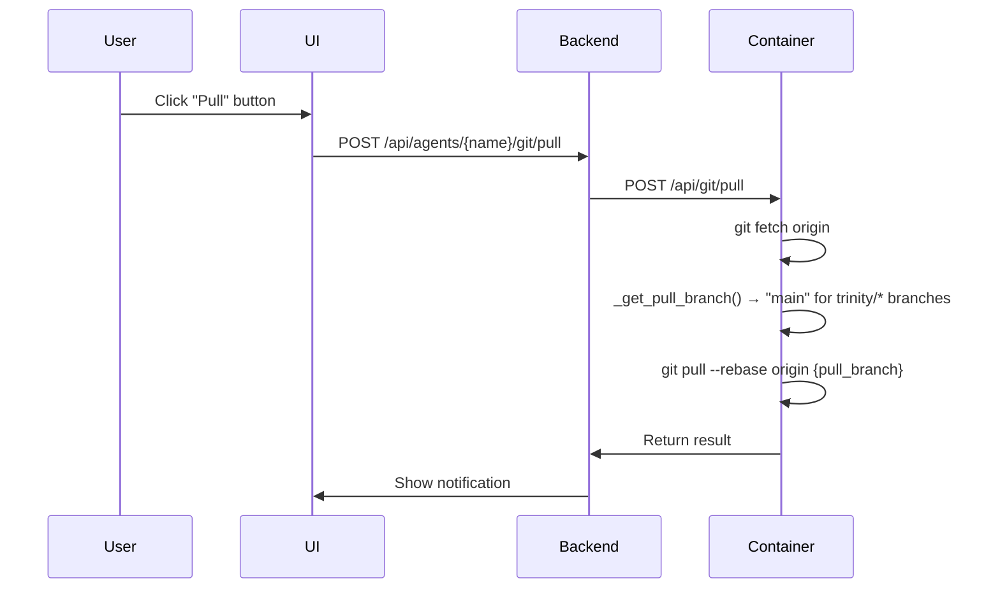
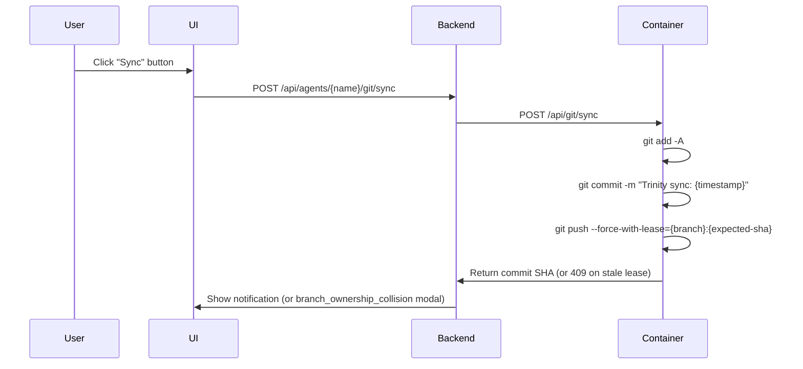
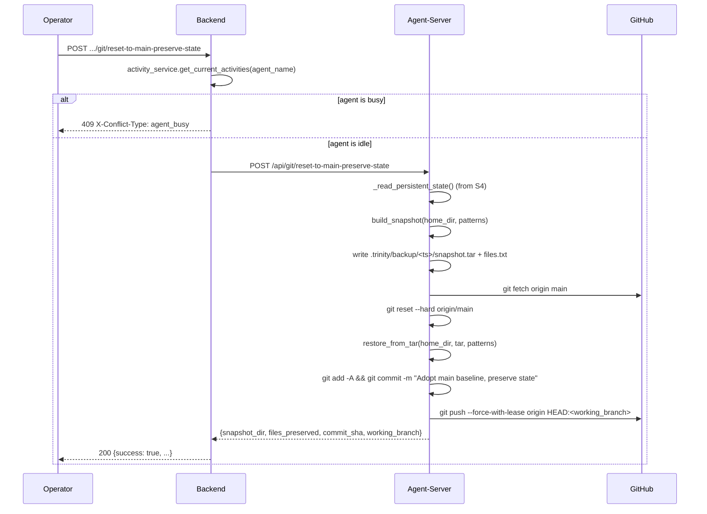

# Feature: GitHub Sync (Phase 7)

## Overview

GitHub-native agents can synchronize with GitHub repositories in two modes:

### Source Mode (Default - Recommended)
**Unidirectional pull-only sync**: Agent tracks a source branch (default: `main`) and can pull updates on demand. Changes made in the agent are local only and not pushed back. This is ideal for agents developed locally and deployed to Trinity.

### Working Branch Mode (Legacy)
**Bidirectional sync**: Agent gets a unique working branch (`trinity/{agent-name}/{instance-id}`) and can push changes back to GitHub. This is the original Phase 7 implementation, now available as an opt-in feature.

## User Stories

**Source Mode**: As a developer, I want to develop agents locally, push to GitHub, and have Trinity pull updates so I can iterate quickly without merge conflicts.

**Working Branch Mode**: As a team using Trinity-native development, I want agent changes synced to a working branch so I can review them via pull requests.

---

## Entry Points

| Type | Location | Description |
|------|----------|-------------|
| **UI** | Agent Detail header | Pull/Push buttons (blue Pull with commits behind count, orange Push with local changes count) |
| **UI** | Git tab in agent detail | Git log/history view |
| **API** | `POST /api/agents/{name}/git/pull` | Pull latest from source branch |
| **API** | `POST /api/agents/{name}/git/sync` | Push changes to GitHub (working branch mode) |
| **API** | `GET /api/agents/{name}/git/status` | Get git repository status |
| **API** | `GET /api/agents/{name}/git/config` | Get stored git config |
| **API** | `POST /api/agents/{name}/git/reset-to-main-preserve-state` | Adopt `origin/main`, preserve persistent-state allowlist (S3, #384) |

---

## Source Mode (Default)

### Configuration

When creating an agent from a GitHub template:

```python
# AgentConfig defaults (src/backend/models.py)
source_branch: Optional[str] = "main"    # Branch to pull from
source_mode: Optional[bool] = True       # True = source mode (pull only)
```

#### Branch Selection (GIT-002)

**URL Syntax** (recommended): Specify branch directly in template URL:
```python
# Via MCP tool or API
create_agent(name="my-agent", template="github:owner/repo@develop")

# Via system manifest
agents:
  my-agent:
    template: "github:owner/repo@feature-branch"
```

**Explicit Parameter**: Pass `source_branch` separately:
```python
create_agent(name="my-agent", template="github:owner/repo", source_branch="develop")
```

**Precedence**: URL syntax (`@branch`) takes precedence if both are provided:
```python
# Uses "develop" branch (URL wins)
create_agent(name="my-agent", template="github:owner/repo@develop", source_branch="main")
```

#### GIT-002 Implementation Details

**Data Flow**: MCP Tool -> Backend CRUD -> Template Service -> startup.sh

| Step | File | Line | Description |
|------|------|------|-------------|
| 1. MCP Parameter | `src/mcp-server/src/types.ts` | 29 | `source_branch?: string` in AgentConfig interface |
| 2. Zod Schema | `src/mcp-server/src/tools/agents.ts` | 201-207 | `source_branch` parameter with description |
| 3. URL Parsing | `src/backend/services/agent_service/crud.py` | 102-113 | Parse `@branch` from template URL, validate alphanumeric + `-_/` |
| 4. Template Lookup | `src/backend/services/agent_service/crud.py` | 115-117 | Reconstruct URL without branch for template lookup |
| 5. Env Var Set | `src/backend/services/agent_service/crud.py` | 328 | `GIT_SOURCE_BRANCH` set from `config.source_branch` |
| 6. Template Clone | `src/backend/services/template_service.py` | 22-41 | `clone_github_repo()` accepts optional `branch` param, adds `-b branch` flag |
| 7. Container Clone | `docker/base-image/startup.sh` | 38-45 | Uses `GIT_SOURCE_BRANCH` in `git clone -b` command |
| 8. Branch Checkout | `docker/base-image/startup.sh` | 57-67 | Source mode checks out and tracks the specified branch |

**Branch Validation** (`crud.py:109`):
```python
# Only alphanumeric, hyphen, underscore, and slash allowed
if url_branch.replace("-", "").replace("_", "").replace("/", "").isalnum():
```

**Clone Command** (`startup.sh:42`):
```bash
CLONE_CMD="git clone -b ${CLONE_BRANCH} ${CLONE_URL} /home/developer"
```

#### Testing Checklist (GIT-002)

| Test Case | Expected Result |
|-----------|-----------------|
| URL syntax: `github:owner/repo@feature-branch` | Agent cloned from `feature-branch` |
| Explicit param: `source_branch: "develop"` | Agent cloned from `develop` |
| Container restart | Branch persists via `GIT_SOURCE_BRANCH` env var |
| Pull operation | Pulls from configured branch, not `main` |
| Invalid branch name | Graceful error: "Could not checkout branch-name" |
| Repo name with `@`: `github:owner/my@repo@branch` | Uses `rsplit("@", 1)` - last `@` is branch separator |
| Both URL and param | URL syntax wins (precedence rule) |

### Environment Variables

```bash
GITHUB_REPO=Owner/repo
GITHUB_PAT=ghp_xxx
GIT_SYNC_ENABLED=true
GIT_SOURCE_MODE=true           # Enables source mode
GIT_SOURCE_BRANCH=main         # Branch to track (default: main)
```

### Startup Behavior (`docker/base-image/startup.sh:41-71`)

```bash
# SOURCE MODE (lines 41-54): Track the source branch directly (unidirectional pull only)
if [ "${GIT_SOURCE_MODE}" = "true" ]; then
    SOURCE_BRANCH="${GIT_SOURCE_BRANCH:-main}"
    echo "Source mode enabled - tracking branch: ${SOURCE_BRANCH}"

    # Checkout the source branch
    git checkout "${SOURCE_BRANCH}" 2>&1 || git checkout -b "${SOURCE_BRANCH}" "origin/${SOURCE_BRANCH}"

    # Set up tracking for pull operations
    git branch --set-upstream-to="origin/${SOURCE_BRANCH}" "${SOURCE_BRANCH}"

    echo "Source mode ready - pull updates with 'git pull'"

# LEGACY WORKING BRANCH MODE (lines 55-71): Create unique working branch
elif [ -n "${GIT_WORKING_BRANCH}" ]; then
    # Check if branch exists on remote
    if git ls-remote --heads origin "${GIT_WORKING_BRANCH}" | grep -q "${GIT_WORKING_BRANCH}"; then
        git checkout "${GIT_WORKING_BRANCH}"
    else
        git checkout -b "${GIT_WORKING_BRANCH}"
        git push -u origin "${GIT_WORKING_BRANCH}"
    fi
fi
```

### Sequence Diagram: Pull from GitHub



### Workflow

```
+-----------+      push       +--------------+      pull       +-------------+
|   Local   |  ----------->   |    GitHub    |   <-----------  |   Trinity   |
|   Dev     |                 |    (main)    |                 |   Agent     |
+-----------+                 +--------------+                 +-------------+
```

1. Develop agent locally
2. Push to GitHub (main branch)
3. Create agent in Trinity from `github:Owner/repo`
4. Agent clones and stays on `main` branch
5. Click "Pull" button to fetch latest changes

### Content Folder Convention

Large generated files (videos, audio, images, exports) should go in `content/` which is automatically gitignored:

```bash
# Created by startup.sh (lines 279-285)
mkdir -p /home/developer/content/{videos,audio,images,exports}

# Ensure content/ is in .gitignore (prevents large files from bloating Git repos)
grep -q "^content/$" /home/developer/.gitignore || echo "content/" >> /home/developer/.gitignore
```

---

## Working Branch Mode (Legacy)

### Configuration

To use working branch mode, explicitly disable source mode:

```python
AgentConfig(
    github_repo="Owner/repo",
    source_mode=False,  # Disable source mode
    # working_branch auto-generated: trinity/{agent-name}/{instance-id}
)
```

### Environment Variables

```bash
GITHUB_REPO=Owner/repo
GITHUB_PAT=ghp_xxx
GIT_SYNC_ENABLED=true
GIT_WORKING_BRANCH=trinity/my-agent/a1b2c3d4  # Auto-generated
```

### Startup Behavior

```bash
# Working branch mode: create unique branch
if [ -n "${GIT_WORKING_BRANCH}" ]; then
    git checkout -b "${GIT_WORKING_BRANCH}"
    git push -u origin "${GIT_WORKING_BRANCH}"
fi
```

### Sequence Diagram: Sync to GitHub



---

## Recovery: Reset-to-Main-Preserve-State (S3, #384)

### Purpose

A first-class recovery path for the **parallel-history deadlock** — when an
agent's `trinity/<agent>/<id>` working branch and `origin/main` share no
common ancestor (e.g., agent was initialised from a state older than a
subsequent rewrite of `main`). Neither "Pull First" nor "Force Push" fixes
this: pull re-applies the conflicting commit and fails identically; force
push overwrites remote with stale parallel history.

The correct recovery — and the only one safe for data — is: **adopt
`origin/main` as the new baseline, overlay instance-specific state, push
with `--force-with-lease`.** This operation exposes that as a first-class
endpoint so operators with UI-only access can recover without SSH-ing into
the container.

Paired with the [persistent-state allowlist](../architecture.md) from S4
(#383) — the allowlist names which paths survive the reset.

### API contract

```
POST /api/agents/{name}/git/reset-to-main-preserve-state
  Auth: OwnedAgentByName (owner or admin)
  Body: none

  200 -> {
    success: true,
    snapshot_dir: ".trinity/backup/2026-04-18T120000Z/",
    files_preserved: ["workspace/decisions.csv", ".trinity/config.yaml", ...],
    commit_sha: "abc1234...",
    working_branch: "trinity/my-agent/abcd1234"
  }
  409 (X-Conflict-Type: agent_busy)     -> agent currently executing a task
  409 (X-Conflict-Type: no_git_config)  -> .git missing or origin unset
  409 (X-Conflict-Type: no_remote_main) -> origin has no `main` branch
  500 -> snapshot/reset/push failure (detail includes the failing step)
```

### Sequence Diagram



### Guardrails (in order)

1. **Backend: agent_busy** — `activity_service.get_current_activities()`
   returns a non-empty list (chat, schedule, tool-call, collaboration in
   progress). Returned before any HTTP call to the agent-server so the
   agent is never interrupted mid-task.
2. **Agent-server: no_git_config** — `/home/developer/.git` missing or
   `git remote get-url origin` fails. Prevents destructive git ops on an
   agent that was never initialised for sync.
3. **Agent-server: no_remote_main** — `git rev-parse --verify origin/main`
   fails after fetch. Prevents resetting to a non-existent baseline.
4. **Always snapshot first** — the compose routine writes the backup tar
   to `.trinity/backup/<iso-ts>/snapshot.tar` *before* `git reset --hard`.
   Even if the push later fails, the operator can pull the tar via the
   Files panel and restore manually.
5. **`--force-with-lease`, never bare `--force`** — aligns with S7 (#382);
   prevents silent clobber of a peer Trinity instance that happens to share
   the working branch.

### Primitives Used

| Component | Purpose | File |
|-----------|---------|------|
| `build_snapshot(home_dir, paths)` | Pure function: walk home_dir, tar files matching allowlist globs | `docker/base-image/agent_server/routers/snapshot.py` |
| `restore_from_tar(home_dir, tar, paths)` | Pure function: extract tar, enforcing allowlist + path-traversal guards | `docker/base-image/agent_server/routers/snapshot.py` |
| `_read_persistent_state()` | S4 reader: load allowlist from `.trinity/persistent-state.yaml` with default fallback | `docker/base-image/agent_server/routers/files.py` |
| `reset_to_main_preserve_state_impl(home_dir, ...)` | Compose routine: snapshot → fetch → reset → overlay → commit → push | `docker/base-image/agent_server/routers/git.py` |
| Backend proxy | Adds `agent_busy` guardrail on top of agent-server response | `src/backend/services/git_service.py` |

### Code References

- Backend endpoint: `src/backend/routers/git.py` (bottom of file)
- Backend service: `src/backend/services/git_service.py::reset_to_main_preserve_state`
- Agent-server endpoint: `docker/base-image/agent_server/routers/git.py` (bottom)
- Agent-server primitives: `docker/base-image/agent_server/routers/snapshot.py`
- Unit tests (mirror pattern):
  - `tests/unit/test_reset_preserve_state_allowlist.py` (snapshot/restore)
  - `tests/unit/test_reset_preserve_state_guardrails.py` (compose + backend proxy)
- Pure-git regression: `tests/git-sync/s3_reset_preserve.sh`
- Integration (opt-in): `tests/test_reset_preserve_state_integration.py`

### Non-goals (owned by other PRs)

- **UI** — the "third modal button" wiring on `GitConflictModal.vue` belongs to S2 (#385 / PR #395).
- **Auto-sync cadence** — S1 (#389).
- **Branch-ownership enforcement** — S7 (#382).
- **`PROTECTED_PATHS` / `EDIT_PROTECTED_PATHS` wiring to the allowlist** — explicitly out of S4/S3 scope.

---

## Data Layer

### Database Model: AgentGitConfig

```python
# src/backend/db_models.py:158-171
class AgentGitConfig(BaseModel):
    """Git configuration for an agent (GitHub-native agents)."""
    id: str
    agent_name: str
    github_repo: str           # e.g., "Owner/repo"
    working_branch: str        # "main" (source mode) or "trinity/{agent}/{id}" (legacy)
    instance_id: str           # 8-char unique identifier
    source_branch: str = "main"  # Branch to pull from (default: main)
    source_mode: bool = False    # If True, track source_branch directly (no working branch)
    created_at: datetime
    last_sync_at: Optional[datetime] = None
    last_commit_sha: Optional[str] = None
    sync_enabled: bool = True
    sync_paths: Optional[str] = None  # JSON array of paths to sync
```

```python
# src/backend/db_models.py:174-182
class GitSyncResult(BaseModel):
    """Result of a git sync operation."""
    success: bool
    commit_sha: Optional[str] = None
    message: str
    files_changed: int = 0
    branch: Optional[str] = None
    sync_time: Optional[datetime] = None
    conflict_type: Optional[str] = None  # "push_rejected", "merge_conflict", etc.
```

### Database Table

```sql
-- src/backend/database.py:418-432
CREATE TABLE IF NOT EXISTS agent_git_config (
    id TEXT PRIMARY KEY,
    agent_name TEXT UNIQUE NOT NULL,
    github_repo TEXT NOT NULL,
    working_branch TEXT NOT NULL,
    instance_id TEXT NOT NULL,
    source_branch TEXT DEFAULT 'main',
    source_mode INTEGER DEFAULT 0,
    created_at TEXT NOT NULL,
    last_sync_at TEXT,
    last_commit_sha TEXT,
    sync_enabled INTEGER DEFAULT 1,
    sync_paths TEXT,
    FOREIGN KEY (agent_name) REFERENCES agent_ownership(agent_name)
);

-- Indexes (src/backend/database.py:620-621)
CREATE INDEX IF NOT EXISTS idx_git_config_agent ON agent_git_config(agent_name);
CREATE INDEX IF NOT EXISTS idx_git_config_repo ON agent_git_config(github_repo);
```

---

## Backend Layer

### Access Control Dependencies

Git endpoints use FastAPI dependencies for access control (defined in `src/backend/dependencies.py:228-295`):

| Dependency | Path Parameter | Access Level | Used By |
|------------|----------------|--------------|---------|
| `AuthorizedAgentByName` | `{agent_name}` | Read access | `get_git_status`, `get_git_log`, `get_git_config`, `pull_from_github` |
| `OwnedAgentByName` | `{agent_name}` | Owner access | `sync_to_github`, `initialize_github_sync` |

> **Updated (2026-01-30)**: `pull_from_github` changed from `OwnedAgentByName` to `AuthorizedAgentByName` - shared users can now pull from GitHub.

**Pattern:**
```python
# src/backend/routers/git.py:43-47
@router.get("/{agent_name}/git/status")
async def get_git_status(
    agent_name: AuthorizedAgentByName,  # Validates user can access agent
    request: Request
):
```

The dependency automatically:
1. Extracts `agent_name` from the path
2. Gets current user from JWT/MCP key
3. Checks access via `db.can_user_access_agent()` or `db.can_user_share_agent()`
4. Returns agent name or raises 403

### Endpoint Signatures

| Endpoint | Line | Dependency | Access Level |
|----------|------|------------|--------------|
| `GET /{agent_name}/git/status` | 43-92 | `AuthorizedAgentByName` | Read |
| `POST /{agent_name}/git/sync` | 95-147 | `OwnedAgentByName` | Owner |
| `GET /{agent_name}/git/log` | 150-174 | `AuthorizedAgentByName` | Read |
| `POST /{agent_name}/git/pull` | 177-211 | `AuthorizedAgentByName` | Authorized (owner, shared, admin) |
| `GET /{agent_name}/git/config` | 214-248 | `AuthorizedAgentByName` | Read |
| `POST /{agent_name}/git/initialize` | 251-389 | `OwnedAgentByName` | Owner |

### Settings Service Integration

GitHub PAT is retrieved via the centralized settings service:

```python
# src/backend/routers/git.py:274
from services.settings_service import get_github_pat

# Used in initialize_github_sync endpoint (line 301)
github_pat = get_github_pat()
```

**Settings Service** (`src/backend/services/settings_service.py:71-76` and `113-115`):
```python
def get_github_pat(self) -> str:
    """Get GitHub PAT from settings, fallback to env var."""
    key = self.get_setting('github_pat')
    if key:
        return key
    return os.getenv('GITHUB_PAT', '')
```

### Per-Agent GitHub PAT (#347)

Agents can optionally have their own GitHub PAT, falling back to the global PAT if not configured.

**Entry Points:**
| Type | Location | Description |
|------|----------|-------------|
| **UI** | Git tab > GitHub Authentication | Status display + Configure button |
| **API** | `GET /api/agents/{name}/github-pat` | Get PAT config status (agent vs global) |
| **API** | `PUT /api/agents/{name}/github-pat` | Set per-agent PAT (validated, encrypted) |
| **API** | `DELETE /api/agents/{name}/github-pat` | Clear per-agent PAT (revert to global) |
| **MCP** | `get_agent_github_pat_status` | Check PAT configuration |
| **MCP** | `set_agent_github_pat` | Set or clear per-agent PAT |

**Database Storage:**
- Column: `agent_git_config.github_pat_encrypted` (TEXT, nullable)
- Encryption: AES-256-GCM via `CredentialEncryptionService` (same as Slack bot tokens)
- Migration: `_migrate_agent_git_config_pat` (#33)

**Helper Function** (`src/backend/routers/git.py:390-409`):
```python
def get_github_pat_for_agent(agent_name: str) -> str:
    """Get per-agent PAT if set, otherwise fall back to global PAT."""
    agent_pat = db.get_agent_github_pat(agent_name)
    if agent_pat:
        return agent_pat
    return get_github_pat()  # Global fallback
```

**DB Mixin** (`src/backend/db/agent_settings/git_pat.py`):
- `get_agent_github_pat(agent_name)` - Returns decrypted PAT or None
- `set_agent_github_pat(agent_name, pat)` - Encrypts and stores PAT
- `clear_agent_github_pat(agent_name)` - Removes per-agent PAT
- `has_agent_github_pat(agent_name)` - Boolean check

**Frontend UI** (`src/frontend/src/components/GitPanel.vue`):
- Status display: "Agent-specific PAT" or "Using Global PAT"
- Configure button opens modal for PAT entry
- PAT validated against GitHub API before saving
- Clear button to revert to global PAT

**Security:**
- PAT values never returned in API responses (only `configured: true/false`)
- PAT validated via `GitHubService.validate_token()` before storage
- Encrypted at rest using platform-wide `CREDENTIAL_ENCRYPTION_KEY`
- Per-agent PAT requires agent restart to take effect in git operations; the
  global PAT is auto-propagated to running agents on update (see next section).

### Global PAT Auto-Propagation (#211)

When an admin updates the global GitHub PAT via
`PUT /api/settings/api-keys/github`, the new value is pushed into each eligible
running agent's `.env` so agents pick up the new token without a restart.

**Service:** `src/backend/services/github_pat_propagation_service.py`

**Eligibility (per target agent):**
1. Container status is `running`.
2. Agent does NOT have a per-agent PAT configured
   (`db.has_agent_github_pat(agent_name) == False`). Per-agent PATs override
   the global and are managed separately.
3. Agent's current `.env` already contains a `GITHUB_PAT` key. Agents that
   never set up GitHub are skipped — avoids injecting unused credentials.

**Mechanism:** Reuses existing agent-side endpoints — no new agent surface.
1. `GET http://agent-{name}:8000/api/credentials/read?paths=.env` — fetch
   current `.env`.
2. Regex-patch the `GITHUB_PAT` line (preserves all other keys and matches the
   agent's `KEY="value"` quoting/escaping format).
3. `POST http://agent-{name}:8000/api/credentials/inject` with the merged
   `.env`. The agent-side handler refreshes its credential sanitizer and
   exports the new value to the in-process environment.

Per-agent calls run concurrently via `asyncio.gather(..., return_exceptions=True)`
with a 30s per-call timeout. Per-agent failures are captured and do NOT roll
back the PAT save.

**Response shape** (from `PUT /api/settings/api-keys/github`):
```json
{
  "success": true,
  "masked": "ghp_****abcd",
  "propagation": {
    "total_running": 3,
    "updated": ["agent-a"],
    "skipped": [
      {"agent_name": "agent-b", "status": "skipped_per_agent_pat", "error": null},
      {"agent_name": "agent-c", "status": "skipped_no_pat", "error": null}
    ],
    "failed": []
  }
}
```

**Delete does NOT propagate** — `DELETE /api/settings/api-keys/github` is
intentionally unchanged; agents keep working with their existing injected PAT
until the next restart.

**Frontend** (`src/frontend/src/views/Settings.vue`): The
`githubPatPropagation` ref renders below the PAT status row — success count,
failed agent list, and skipped reasons.

**Tests:** `tests/test_github_pat_propagation_unit.py` (11 cases: env
patching, per-agent PAT skip, no-GITHUB_PAT skip, stopped-agent skip, merge
preserves other keys, partial-failure isolation).

### GitHub Service Integration

Repository operations use the centralized GitHub service:

```python
# src/backend/routers/git.py:275
from services.github_service import GitHubService, GitHubError

# Used in initialize_github_sync endpoint (lines 311-329)
gh = GitHubService(github_pat)
repo_info = await gh.check_repo_exists(body.repo_owner, body.repo_name)

if not repo_info.exists:
    create_result = await gh.create_repository(
        owner=body.repo_owner,
        name=body.repo_name,
        private=body.private,
        description=body.description
    )
```

**GitHub Service** (`src/backend/services/github_service.py:60-265`):
- `GitHubService.__init__(pat)` - line 70-82
- `check_repo_exists(owner, name)` - line 141-175, returns `GitHubRepoInfo`
- `create_repository(owner, name, private, description)` - line 177-264, returns `GitHubCreateResult`
- `validate_token()` - line 101-118, returns `(is_valid, username)`
- `get_owner_type(owner)` - line 120-139, returns `OwnerType.USER` or `OwnerType.ORGANIZATION`

### Git Service Layer

**Location**: `src/backend/services/git_service.py`

| Function | Line | Description |
|----------|------|-------------|
| `generate_instance_id()` | 22-24 | Create 8-char UUID for agent |
| `generate_working_branch()` | 27-29 | Create `trinity/{agent}/{id}` branch name |
| `create_git_config_for_agent()` | 32-61 | Store config in database |
| `get_git_status()` | 64-85 | Proxy to agent `/api/git/status` |
| `sync_to_github()` | 88-169 | Proxy to agent `/api/git/sync` with conflict handling |
| `get_git_log()` | 172-193 | Proxy to agent `/api/git/log` |
| `pull_from_github()` | 196-236 | Proxy to agent `/api/git/pull` with conflict handling |
| `get_agent_git_config()` | 239-241 | Get config from database |
| `delete_agent_git_config()` | 244-246 | Delete git config when agent is deleted |
| `initialize_git_in_container()` | 262-415 | Initialize git in agent container (preserves remote history via fetch+reset when possible) |
| `check_git_initialized()` | 402-427 | Check if git exists in container |

---

## Frontend Layer

### useGitSync Composable

**Location**: `src/frontend/src/composables/useGitSync.js`

**Reactive State** (lines 11-21):
- `gitStatus` - Current git status from agent
- `gitLoading` / `gitSyncing` / `gitPulling` - Loading states
- `gitConflict` / `showConflictModal` - Conflict handling state

**Computed Properties** (lines 22-31):
- `gitHasChanges` - True if local changes or commits ahead
- `gitChangesCount` - Number of local file changes
- `gitBehind` - Number of commits behind remote

**Polling Behavior** (lines 161-172):
- Git status polled every 60 seconds to detect changes
- Polling starts on component mount, stops on unmount
- Manual refresh available via refresh button

```javascript
// Git status polling (line 161-165)
const startGitStatusPolling = () => {
  if (!hasGitSync.value) return
  loadGitStatus() // Load immediately
  gitStatusInterval = setInterval(loadGitStatus, 60000) // Then every 60 seconds
}

// Pull from GitHub (line 102-136) - supports strategy parameter
const pullFromGithub = async (strategy = 'clean') => {
  const result = await agentsStore.pullFromGithub(agentRef.value.name, { strategy })
  // Handles 409 conflicts by showing GitConflictModal
}

// Sync to GitHub (line 56-96) - supports strategy parameter
const syncToGithub = async (strategy = 'normal') => {
  const result = await agentsStore.syncToGithub(agentRef.value.name, { strategy })
  // Handles 409 conflicts by showing GitConflictModal
}

// Conflict resolution (line 142-151)
const resolveConflict = async (strategy) => {
  // Retries the failed operation with user-selected strategy
}
```

### UI Controls (AgentDetail.vue)

| Button | Color | Display | Action | Mode |
|--------|-------|---------|--------|------|
| Pull | Blue (when behind) / Gray (up to date) | `Pull (N)` showing commits behind | `pullFromGithub()` | Both modes |
| Push | Orange (when changes) / Gray (clean) | `Push (N)` showing local changes count | `syncToGithub()` | Working branch mode |
| Refresh | Gray | Icon only | `refreshGitStatus()` | Both modes |

---

## API Reference

### GET /api/agents/{name}/git/config

Returns git configuration including source mode settings:

```json
{
  "git_enabled": true,
  "github_repo": "Owner/repo",
  "working_branch": "main",
  "source_branch": "main",
  "source_mode": true,
  "instance_id": "a1b2c3d4",
  "created_at": "2025-12-30T12:00:00",
  "last_sync_at": null,
  "sync_enabled": true
}
```

### POST /api/agents/{name}/git/pull

Pull latest changes from source branch:

```json
{
  "success": true,
  "message": "Pulled latest changes from main"
}
```

### POST /api/agents/{name}/git/sync

Push changes to working branch (only in working branch mode):

```json
{
  "success": true,
  "commit_sha": "abc123...",
  "files_changed": 3,
  "branch": "trinity/my-agent/a1b2c3d4",
  "sync_time": "2025-12-30T12:00:00"
}
```

---

## Migration from Working Branch to Source Mode

Existing agents using working branch mode will continue to work. To switch an agent to source mode:

1. Delete the agent
2. Recreate with default settings (source_mode=true)

Or, if you want to preserve agent state:
1. Sync any pending changes to GitHub
2. Merge working branch to main
3. Delete and recreate the agent

---

## Conflict Resolution

Both pull and sync operations support automatic conflict detection and resolution strategies.

### Pull Conflict Strategies

When a pull operation fails due to local changes conflicting with remote:

| Strategy | Description | When to Use |
|----------|-------------|-------------|
| `clean` (default) | Simple pull with rebase. Fails if conflicts. | When you have no local changes |
| `stash_reapply` | Stash local changes, pull, reapply stash | When you want to keep local changes |
| `force_reset` | Hard reset to remote, discard all local changes | When remote is source of truth |

### Sync (Push) Conflict Strategies

When a push operation fails because remote has newer changes:

| Strategy | Description | When to Use |
|----------|-------------|-------------|
| `normal` (default) | Stage, commit, push. Fails if remote has changes. | When you expect clean push |
| `pull_first` | Pull latest first, then stage, commit, push | Standard workflow with concurrent changes |
| `force_push` | Force push, overwriting remote | When local is source of truth |

### Conflict Resolution UI

When a conflict is detected (HTTP 409 response), the UI shows a modal with options:

```
+---------------------------------------------+
| Pull Conflict                               |
|                                             |
| Pull failed: merge conflict detected        |
|                                             |
| +-------------------------------------------+
| | Stash & Reapply (Recommended)             |
| | Save local changes, pull, reapply         |
| +-------------------------------------------+
|                                             |
| +-------------------------------------------+
| | Force Replace Local                       |
| | Discard all local changes (destructive)   |
| +-------------------------------------------+
|                                             |
|                              [Cancel]       |
+---------------------------------------------+
```

### Parallel-history modal (S2, #385)

When the agent's branch and `origin/<pull_branch>` have diverged with no recent
common ancestor, the standard Pull First / Force Push options would both lose
data. The frontend detects this at modal-open time (no new endpoint, no extra
round-trip) and renders a different modal variant.

**Predicate** (`src/frontend/src/composables/useGitSync.js:44-55`):

```javascript
const PARALLEL_HISTORY_STALE_DAYS = 30
const isParallelHistory = computed(() => {
  const s = gitStatus.value
  if (!s) return false
  if ((s.behind || 0) <= 0) return false
  const noAncestor = !s.common_ancestor_sha
  const staleAncestor = typeof s.common_ancestor_age_days === 'number'
    && s.common_ancestor_age_days >= PARALLEL_HISTORY_STALE_DAYS
  return noAncestor || staleAncestor
})
```

**Label-agnostic copy**: a sibling `pullBranch` computed
(`useGitSync.js:36-38`) echoes the backend `pull_branch` field; all modal copy
uses `{{ pullBranchLabel }}` so working-branch agents (`trinity/*` -> `main`)
and non-default upstreams (`master`, `trunk`, ...) all render correctly.

**Modal variant** (`src/frontend/src/components/GitConflictModal.vue:106-184`):
purely additive sibling `<div v-if="show && isParallelHistory">`. The original
Pull/Push variant has its outer `v-if` narrowed to
`show && !isParallelHistory` (line 2) so the new variant takes priority — no
existing branches were rewritten.

| Element | Description |
|---------|-------------|
| Title | "Your agent cannot sync" |
| Body | Plain-English divergence explanation, references `{{ pullBranchLabel }}` |
| Primary button | "Adopt latest upstream (preserve my state)" -> emits `resolve('adopt_upstream_preserve_state')` |
| Secondary button | "Force push anyway" with destructive warning -> emits `resolve('force_push')` |

**Recovery dispatch**: `resolveConflict()` in `useGitSync.js:165-182` short-
circuits the `adopt_upstream_preserve_state` strategy to a dedicated resolver,
`adoptUpstreamPreserveState()` (lines 189-220), which calls
`agentsStore.adoptUpstreamPreserveState(agentName)` -> `POST
/api/agents/{name}/git/reset-to-main-preserve-state`.

**Deferred dependency on #384**: the S3 endpoint is not yet live. The resolver
handles two not-yet-wired states explicitly (no silent no-op): if the store
method is missing it surfaces "Adopt-upstream action requires backend endpoint
from issue #384 (not yet available)."; on HTTP 404 it surfaces "Adopt-upstream
endpoint not available yet (blocked on issue #384)."

**Wiring**: `src/frontend/src/views/AgentDetail.vue` forwards `pullBranch` and
`isParallelHistory` from the composable into the `<GitConflictModal>` mount.

### Regression tests (S2, #385)

| File | Scope |
|------|-------|
| `tests/git-sync/test_p2_parallel_history_detection.sh` | Drives the real FastAPI handler in-process and asserts `pull_branch`, `common_ancestor_sha`, `common_ancestor_age_days` are present and well-formed in the `/api/git/status` response. |
| `tests/git-sync/test_s2_usegitsync.test.js` | Vitest scenarios for the `isParallelHistory` predicate (no ancestor, stale ancestor, recent ancestor, behind=0 short-circuit). |

### API Request Format

```json
// Pull with strategy
POST /api/agents/{name}/git/pull
{
  "strategy": "stash_reapply"  // "clean", "stash_reapply", "force_reset"
}

// Sync with strategy
POST /api/agents/{name}/git/sync
{
  "strategy": "pull_first",  // "normal", "pull_first", "force_push"
  "message": "Optional commit message"
}
```

### Error Response (Conflict)

```json
// HTTP 409 Conflict
{
  "detail": "Pull failed: merge conflict detected",
  "conflict_class": "PARALLEL_HISTORY"
}
// Headers:
//   X-Conflict-Type:  merge_conflict | local_uncommitted | push_rejected
//   X-Conflict-Class: AHEAD_ONLY | BEHIND_ONLY | PARALLEL_HISTORY |
//                     UNCOMMITTED_LOCAL | AUTH_FAILURE |
//                     WORKING_BRANCH_EXTERNAL_WRITE | UNKNOWN
```

The `conflict_class` body field and `X-Conflict-Class` header were added in S5 (#386); the legacy `X-Conflict-Type` header is preserved for backward compatibility. See [Conflict classification (S5, #386)](#conflict-classification-s5-386) below.

### Conflict classification (S5, #386)

Operators staring at `merge_conflict` and a wall of raw git stderr could not tell which of several distinct failure shapes they were looking at. S5 adds a small classifier that maps the stderr + ahead/behind counts to a stable symbolic class, and threads that class through the API surfaces so the modal can render per-class copy.

**Enum** — `ConflictClass` (`src/backend/services/git_service.py:28-43`):

| Member | Meaning |
|--------|---------|
| `AHEAD_ONLY` | Local has unpushed commits, remote has not moved |
| `BEHIND_ONLY` | Remote has new commits, local has none |
| `PARALLEL_HISTORY` | Branches diverged; rebase apply failed (P2 trap) |
| `UNCOMMITTED_LOCAL` | Working tree dirty, git refused the operation |
| `AUTH_FAILURE` | Remote rejected credentials (expired/missing PAT) |
| `WORKING_BRANCH_EXTERNAL_WRITE` | Ref moved under us (P5 clobber signature) |
| `UNKNOWN` | Stderr did not match any known shape |

**Classifier** — `classify_conflict(stderr, ahead, behind, common_ancestor_sha=None) -> ConflictClass` (`src/backend/services/git_service.py:77-130`). Pure function, no IO, regex-only. `common_ancestor_sha` is accepted for forward compatibility (#385 discriminator) but unused today. Decision order: auth → uncommitted → external-write → parallel-history → numeric fallback → `UNKNOWN`. Regex patterns are drawn from `tests/git-sync/fixtures/p2_parallel_history_stderr.txt` and `tests/git-sync/fixtures/p5_clobber_stderr.txt`.

**Agent-server mirror** — `docker/base-image/agent_server/utils/git_conflict.py` (NEW) holds a parallel implementation. The agent-server runs inside the container image and does not import from the backend, so the classifier is duplicated intentionally. The two copies must be kept in sync; the backend copy is canonical. `docker/base-image/agent_server/routers/git.py:41-68` adds a shared `_conflict_response()` helper that replaced 5 prior `raise HTTPException(status_code=409, detail=...)` sites; it returns a `JSONResponse` with `conflict_class` in the body and both `X-Conflict-Type` + `X-Conflict-Class` headers.

**Wire-level field** — `GitSyncResult.conflict_class` added in `src/backend/db_models.py:231`. `src/backend/routers/git.py:134-140` (sync) and `:212-218` (pull) forward it via the `X-Conflict-Class` header alongside `X-Conflict-Type`. The backend git service reads the header or body field from agent responses and propagates it (`src/backend/services/git_service.py:267-276` sync path, `:346-355` pull path).

**Frontend modal** — `src/frontend/src/components/GitConflictModal.vue:150-209` defines a `COPY` lookup table keyed on `conflictClass`; each entry provides `title`, `body` (bullet list), and `recommendation`. Raw stderr is rendered inside an expandable `<details>` block labeled "Git details (for developers)". Resolve buttons and their strategies are unchanged. **Pre-S5 fallback**: when `conflictClass` is absent (older agents), the modal falls back to the pre-S5 generic title ("Pull Conflict" / "Push Conflict") and uses `conflict.message` as the recommendation (`GitConflictModal.vue:195-209`), so older agent images keep working without a forced upgrade.

**Composable plumbing** — `src/frontend/src/composables/useGitSync.js:87-93` (sync branch) and `:131-138` (pull branch) read `err.response?.headers?.['x-conflict-class']` and store it on the existing `gitConflict` ref. No branching logic change; the modal reads the new field directly.

**Regression tests** — `tests/git-sync/test_s5_conflict_classifier.py` (11 pytest cases covering each enum member, the fallback, and the two stderr fixtures) and `tests/git-sync/test_s5_modal.spec.js` (5 Vitest snapshot scenarios for the per-class copy and the pre-S5 fallback).

### Component Files

| Component | File | Line Range | Description |
|-----------|------|------------|-------------|
| Modal | `src/frontend/src/components/GitConflictModal.vue` | - | Conflict resolution UI |
| Composable | `src/frontend/src/composables/useGitSync.js` | 1-202 | State management with conflict handling |
| Agent-Server | `docker/base-image/agent_server/routers/git.py` | 1-854 | Git operations with strategies + S7 Layer 3 lease/collision surfacing |
| Backend Router | `src/backend/routers/git.py` | 1-389 | API endpoints with strategy params |
| Git Service | `src/backend/services/git_service.py` | 1-427 | Proxy to agent with conflict detection |
| Settings Service | `src/backend/services/settings_service.py` | 71-76, 113-115 | GitHub PAT retrieval |
| GitHub Service | `src/backend/services/github_service.py` | 60-265 | GitHub API operations |
| Dependencies | `src/backend/dependencies.py` | 228-295 | Access control for agent routes |
| DB Models | `src/backend/db_models.py` | 158-182 | AgentGitConfig and GitSyncResult |

### Working Branch Pull Logic (docker/base-image/agent_server/routers/git.py)

The `_get_pull_branch()` helper (line 17-30) detects `trinity/*` working branches and redirects pull/status operations to `origin/main`:

```python
def _get_pull_branch(current_branch: str, home_dir: Path) -> str:
    """For trinity/* working branches, pull from main instead."""
    if not current_branch.startswith("trinity/"):
        return current_branch
    # Verify origin/main exists, fall back to current_branch if not
    result = subprocess.run(
        ["git", "rev-parse", "--verify", "origin/main"], ...
    )
    return "main" if result.returncode == 0 else current_branch
```

**Used in:** `get_git_status()` (ahead/behind count), `pull_from_github()` (all strategies), `sync_to_github()` (`pull_first` strategy). Push operations still use `current_branch` (the working branch).

### Agent-Server Endpoints (docker/base-image/agent_server/routers/git.py)

| Endpoint | Line Range | Description |
|----------|------------|-------------|
| `GET /api/git/status` | — | Get repository status, branch, changes, ahead/behind (uses `_get_pull_branch` for behind count); surfaces `pull_branch`, `common_ancestor_sha`, `common_ancestor_age_days` for parallel-history detection (S2, #385); persists last-remote-sha after fetch (S7 Layer 3, #382) |
| `POST /api/git/sync` | — | Stage, commit, push with strategy support (`pull_first` pulls from `pull_branch`); `force_push` uses `--force-with-lease=<branch>:<expected-sha>` (S7 Layer 3, #382) |
| `GET /api/git/log` | — | Get recent commit history |
| `POST /api/git/pull` | — | Pull from remote with conflict strategies (targets `pull_branch`) |

---

## Branch-Ownership Collision Handling (S7 Layer 3, #382)

When two Trinity instances bind to the same working branch, only one can push without clobbering the other. Layers 0 and 2 (reservation helper + partial UNIQUE index — see [github-repo-initialization.md](github-repo-initialization.md)) prevent the binding from being created in the first place. Layer 3 — the push-time guard documented here — is the last line of defense for instances that already have a stale binding from before those constraints existed.

**2026-04-17 incident reference**: This Layer 3 change is the response to the alpaca-vybe-live silent clobber, where a peer instance's `git push --force` overwrote in-flight work without either side noticing. Tier-1 regression coverage lives at `tests/git-sync/test_p5_branch_ownership.sh`.

### Persisted last-remote-sha (the lease)

After every successful `git fetch`, the agent server records the observed remote SHA to `~/.trinity/last-remote-sha/<branch>` (file path mirrors the branch layout, so `trinity/<agent>/<id>` becomes nested directories). The next push reads that value and passes it as the `expected-sha` argument to `--force-with-lease`.

| Helper | File | Lines | Purpose |
|--------|------|-------|---------|
| `LAST_REMOTE_SHA_DIR` | `docker/base-image/agent_server/routers/git.py` | 18-23 | `~/.trinity/last-remote-sha` (under bind-mounted home, survives restarts) |
| `_sha_file_for_branch()` | `docker/base-image/agent_server/routers/git.py` | 46-53 | Mirrors branch layout as nested dirs |
| `_persist_last_remote_sha()` | `docker/base-image/agent_server/routers/git.py` | 56-94 | Called after fetch; failure is logged, never raised |
| `_read_last_remote_sha()` | `docker/base-image/agent_server/routers/git.py` | 97-106 | Read on push path; returns `None` if missing |

**Persist call sites** (after every successful fetch):
- `get_git_status()` — line 249-250 (after the status-path fetch)
- `sync_to_github()` `pull_first` strategy — line 353-354 (after the pre-sync fetch)

**Failure mode**: if persistence fails (disk full, permission error), the next push has no lease on file and falls back to the unparameterized `git push --force-with-lease`, which uses the remote-tracking ref as the expected-sha. Still safer than plain `--force`; degraded for one push then self-heals on the next fetch.

### Force-push with lease

`sync_to_github()` `force_push` strategy (lines 489-536):

```python
lease_sha = _read_last_remote_sha(current_branch)
push_cmd: list[str] = ["git", "push"]
if lease_sha:
    push_cmd.append(f"--force-with-lease={current_branch}:{lease_sha}")
else:
    push_cmd.append("--force-with-lease")  # remote-tracking-ref fallback
push_cmd += ["origin", current_branch]
```

If a peer instance pushed to the branch since this instance last fetched, `origin/<branch>` is now ahead of `lease_sha`, the lease is stale, and `git push` exits non-zero with `stderr` containing `stale info`. `_is_stale_lease_rejection()` (lines 168-171) detects that signature.

### HTTP 409 + collision header

On lease rejection, the endpoint returns:

```
HTTP/1.1 409 Conflict
X-Conflict-Type: branch_ownership_collision

{"detail": "Force-push rejected: another instance has written to this branch since the last fetch. ..."}
```

(`agent_server/routers/git.py:522-532`.) The new `branch_ownership_collision` value is distinct from the existing `push_rejected` (non-fast-forward without `force_push`) and `merge_conflict` cases, so the frontend can show a dedicated remediation modal instead of offering a "force push again" button (which would fail the same way).

### Operator-queue collision alert

`_record_push_collision()` (lines 109-165) appends a structured `alert` entry to `~/.trinity/operator-queue.json` when the lease is rejected:

```json
{
  "id": "git-collision-<uuid12>",
  "type": "alert",
  "status": "pending",
  "priority": "high",
  "title": "Git push rejected on <branch> — branch binding collision",
  "question": "Another Trinity instance wrote to this working branch since this agent last fetched. ...",
  "options": null,
  "context": {
    "branch": "<branch>",
    "expected_sha": "<lease-sha or null>",
    "git_stderr": "<truncated to 2000 chars>",
    "remediation": "Assign a fresh working branch to one of the colliding agents (Fleet → Branch Bindings → Assign fresh branch)."
  },
  "created_at": "<utc iso>"
}
```

The backend's `OperatorQueueSyncService` (5s polling, see `services/operator_queue_service.py`) picks this up on its next sweep and surfaces it in the Operating Room. The losing instance now learns it lost the race, instead of believing its push succeeded — that's the substantive behavior change versus the pre-#382 silent-clobber regime.

Append failures are caught and logged but never raised — surfacing the alert is best-effort; the 409 to the caller is the authoritative signal.

#### `GET /api/git/status` — parallel-history fields (S2, #385)

In addition to the existing `branch`, `ahead`, `behind`, `changes_count`, etc., the
status response now carries three fields used by the frontend to distinguish a
"simple behind" state from parallel histories where neither Pull First nor Force
Push is the right answer:

| Field | Type | Source | Notes |
|-------|------|--------|-------|
| `pull_branch` | string | `_get_pull_branch(current_branch, home_dir)` (line 70-83); returned at line 235 | Effective upstream branch — `main` for `trinity/*` working branches, otherwise the current branch. Lets the frontend keep copy label-agnostic (no hardcoded "main"). |
| `common_ancestor_sha` | string | `git merge-base HEAD origin/<pull_branch>` (line 184-192); returned at line 242 | Empty string when no merge-base exists (truly disjoint histories). |
| `common_ancestor_age_days` | int \| null | `git log -1 --format=%cI <sha>` parsed to days (line 194-213); returned at line 243 | `null` when the ancestor date can't be parsed (logged as a warning). |

`ahead` and `behind` are unchanged — they still come from
`git rev-list --left-right --count origin/<pull_branch>...HEAD` (line 163-176).

---

## Security Considerations

1. **GitHub PAT**: Passed as environment variable, never exposed in logs or API responses
2. **Remote URL Sanitization**: Credentials stripped before display
3. **Force Push Protection**: All pushes (normal AND `force_push` strategy) use `--force-with-lease`. `force_push` parameterizes the lease with the persisted last-observed remote SHA so a stale binding cannot clobber a peer (S7 Layer 3, #382). See "Branch-Ownership Collision Handling" above.
4. **Force Operations Warning**: UI shows red destructive warnings for force operations
5. **Infrastructure Files**: `content/`, `.local/` auto-added to `.gitignore`
6. **Access Control**: Read endpoints and pull use `AuthorizedAgentByName` (owner/shared/admin), write endpoints (sync/initialize) use `OwnedAgentByName` (owner/admin only)

---

## Status

Working - Pull fix for working branches (2026-03-26)

---

## Related Flows

| Direction | Flow | Relationship |
|-----------|------|--------------|
| **Upstream** | [Template Processing](template-processing.md) | GitHub templates trigger git sync setup |
| **Upstream** | [Agent Lifecycle](agent-lifecycle.md) | Agent creation enables git sync |
| **Downstream** | [Git Sync Health](git-sync-health.md) | Auto-sync heartbeat + observability on top of this flow (#389, #390) |
| **Downstream** | Content generation | Large files go to `content/` folder |
| **Related** | [Async Docker Operations](async-docker-operations.md) | Git commands use async docker exec (DOCKER-001) |

---

## Revision History

| Date | Changes |
|------|---------|
| 2026-04-19 | **S7 Layer 3 push-time guard** (#382, PR #396): `sync_to_github()` `force_push` strategy now uses `git push --force-with-lease=<branch>:<expected-sha>` instead of plain `--force` (`docker/base-image/agent_server/routers/git.py`). The expected-sha is the remote value last observed at fetch, persisted to `~/.trinity/last-remote-sha/<branch>` via `_persist_last_remote_sha()` after every successful fetch. Stale-lease rejection returns HTTP 409 with header `X-Conflict-Type: branch_ownership_collision` and appends a structured alert to `~/.trinity/operator-queue.json` (`_record_push_collision()`), which the backend's `OperatorQueueSyncService` surfaces in the Operating Room on its next 5s poll. Persistence/append failures are logged, never raised. Response to the 2026-04-17 alpaca-vybe-live silent clobber; Tier-1 regression at `tests/git-sync/test_p5_branch_ownership.sh`. Layers 0 and 2 (reservation helper + partial UNIQUE index) are documented in `github-repo-initialization.md`. |
| 2026-04-19 | **S5 — operator-readable conflict diagnosis** (#386, PR #397): Added `ConflictClass` enum + pure `classify_conflict()` in `src/backend/services/git_service.py`, mirrored in new `docker/base-image/agent_server/utils/git_conflict.py`. New `conflict_class` field on `GitSyncResult` and `X-Conflict-Class` response header on 409s. Agent-server collapsed 5 `HTTPException` sites behind a shared `_conflict_response()` helper. `GitConflictModal.vue` picks per-class title/body/recommendation from a `COPY` lookup; raw stderr in an expandable `<details>`; pre-S5 fallback preserves old strings. Composable `useGitSync.js` reads the header into the existing `gitConflict` ref. Regression coverage in `tests/git-sync/test_s5_conflict_classifier.py` (11 pytest cases) and `tests/git-sync/test_s5_modal.spec.js` (5 Vitest snapshots). |
| 2026-04-19 | **S2 — Parallel-history detection at modal open** (#385, PR #395): `get_git_status()` in `docker/base-image/agent_server/routers/git.py` now also returns `pull_branch`, `common_ancestor_sha`, and `common_ancestor_age_days`, computed via `git merge-base HEAD origin/<pull_branch>` and `git log -1 --format=%cI`. Existing `ahead`/`behind` are unchanged. Frontend `useGitSync.js` adds `pullBranch`, `isParallelHistory` predicate (threshold 30 days), and an `adoptUpstreamPreserveState()` resolver that POSTs to `/api/agents/{name}/git/reset-to-main-preserve-state` (S3 / #384, not yet live — surfaces a clear "blocked on #384" notification on 404 / missing store method). `GitConflictModal.vue` adds a sibling `<div v-if="show && isParallelHistory">` variant titled "Your agent cannot sync" with primary "Adopt latest upstream (preserve my state)" and secondary "Force push anyway"; the existing variant's outer `v-if` is narrowed to `show && !isParallelHistory` so the new branch takes priority. All copy uses `{{ pullBranchLabel }}` — no hardcoded "main". `AgentDetail.vue` forwards the two new reactives into the modal mount. Regression tests: `tests/git-sync/test_p2_parallel_history_detection.sh` and `tests/git-sync/test_s2_usegitsync.test.js`. |
| 2026-04-19 | **Sync observability** (#389, #390): dual `ahead_main`/`ahead_working` + `behind_main`/`behind_working` in `GET /api/git/status` (fixes P6). New `auto_sync_enabled` and `freeze_schedules_if_sync_failing` columns on `agent_git_config`. Full sync-health feature documented in [git-sync-health.md](git-sync-health.md). |
| 2026-04-18 | **Reset-preserve-state operation** (S3, #384): Added `POST /api/agents/{name}/git/reset-to-main-preserve-state` plus two agent-server primitives (`/api/agent-server/snapshot`, `/api/agent-server/restore` in `routers/snapshot.py`) and a compose routine in `agent_server/routers/git.py`. Recovery path: snapshot allowlist (S4) → `git reset --hard origin/main` → overlay snapshot → commit `Adopt main baseline, preserve state` → `git push --force-with-lease`. Guardrails: 409 `agent_busy` (backend checks activity service), `no_git_config`, `no_remote_main`. Backup always written to `.trinity/backup/<iso-ts>/` before destructive ops. Mirrored unit tests in `tests/unit/test_reset_preserve_state_*.py` plus pure-git regression `tests/git-sync/s3_reset_preserve.sh`. |
| 2026-04-16 | **Per-Agent GitHub PAT** (#347): Added per-agent PAT configuration. Agents can now use their own GitHub PAT instead of the global one. DB column `github_pat_encrypted` in `agent_git_config`, encrypted with AES-256-GCM. 3 new API endpoints (GET/PUT/DELETE), 2 MCP tools, GitPanel.vue settings UI. Helper `get_github_pat_for_agent()` provides fallback logic. |
| 2026-03-26 | **Fix git pull for working branches** (#195): Added `_get_pull_branch()` helper that detects `trinity/*` branches and redirects pull/status to `origin/main`. Fixed `git fetch --dry-run` → `git fetch origin` in status endpoint. Fixed `initialize_git_in_container()` to preserve remote history via `git fetch + reset` instead of `git init + force push`. Tests in `tests/unit/test_git_pull_branch.py`. |
| 2026-02-28 | **Git Branch Support** (GIT-002): Added complete data flow documentation with line numbers. URL syntax (`github:owner/repo@branch`) parses branch in crud.py:102-113. MCP types.ts:29 and agents.ts:201-207 expose `source_branch` parameter. template_service.py:22-41 passes branch to git clone. startup.sh:38-45 uses `-b` flag. Added testing checklist from requirements spec. |
| 2026-02-24 | **Async Docker Operations** (DOCKER-001): `execute_command_in_container()` in docker_service.py now async. All git_service.py calls await this function. `check_git_initialized()` now async. routers/git.py updated to await. |
| 2026-01-30 | **Git pull permission fix**: `POST /{agent_name}/git/pull` changed from `OwnedAgentByName` to `AuthorizedAgentByName` - shared users can now pull from GitHub. Updated Access Control Dependencies, Endpoint Signatures, and Security Considerations sections. |
| 2026-01-23 | **Line number verification**: Updated all line number references to match current implementation. Added GitSyncResult model, delete_agent_git_config function, agent-server endpoint table. Expanded useGitSync composable documentation with reactive state and computed properties. Added database indexes. |
| 2026-01-12 | **Polling interval optimization**: Git status polling changed from 30s to 60s for reduced API load. Added polling behavior documentation to useGitSync composable section. |
| 2026-01-12 | Renamed "Sync" button to "Push" for consistent Pull/Push terminology. Pull button now shows commits behind count when remote has updates. Both buttons use dynamic coloring (active color when action available, gray when up to date). |
| 2025-12-31 | Updated with access control dependencies (`AuthorizedAgentByName`, `OwnedAgentByName`), settings service (`get_github_pat()`), and GitHub service integration. Added line number references. |
| 2025-12-30 | Added conflict resolution with pull/sync strategies and GitConflictModal UI. |
| 2025-12-30 | Added source mode (pull-only) as default. Working branch mode now legacy. |
| 2025-12-06 | Updated agent-server references to modular structure |
| 2025-12-02 | Initial documentation (working branch mode) |
